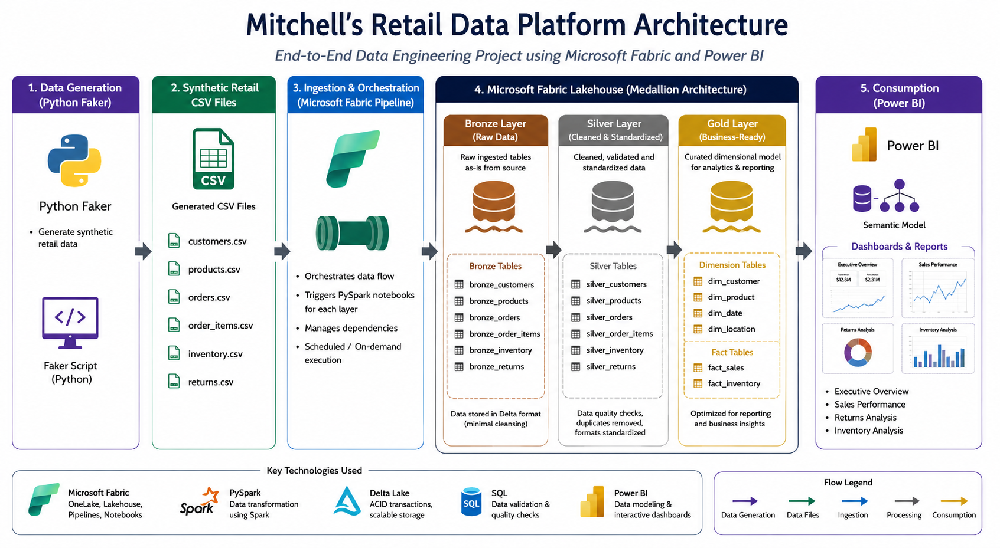

<<<<<<< HEAD
# Mitchell’s Retail Data Platform

## Project Overview

Mitchell’s Retail Data Platform is an end-to-end retail analytics and data engineering project built using Microsoft Fabric, PySpark, SQL, and Power BI.

The project simulates a modern retail environment where synthetic retail datasets are generated using Python Faker, ingested into Microsoft Fabric, transformed through a Medallion Architecture (Bronze, Silver, Gold), and visualized in Power BI dashboards.

This project demonstrates:
- Data ingestion and orchestration
- Medallion Architecture implementation
- PySpark transformations
- Data quality validation
- Dimensional modelling
- Power BI reporting and analytics
- Git version control and project documentation

---

# Tech Stack

| Tool | Purpose |
|------|----------|
| Microsoft Fabric | Data engineering platform |
| Lakehouse | Centralized data storage |
| PySpark | Data transformation |
| Fabric Pipelines | Workflow orchestration |
| SQL | Data validation and querying |
| Power BI | Reporting and dashboarding |
| Python Faker | Synthetic data generation |
| Git & GitHub | Version control |

---

# Architecture

The project uses Python Faker to generate synthetic retail datasets, which are exported as CSV files and ingested into Microsoft Fabric through a pipeline-driven workflow.

The data flows through Bronze, Silver, and Gold layers before being consumed in Power BI dashboards.



---

# Data Pipeline

The Fabric pipeline orchestrates notebook execution across all Medallion Architecture layers.

Pipeline Flow:
1. Bronze ingestion notebook executes first
2. Silver transformation notebook executes after Bronze completion
3. Gold modelling notebook executes after Silver completion


---

# Medallion Architecture

## Bronze Layer (Raw Data)

Stores raw ingested datasets from generated CSV files with minimal transformation.

### Bronze Tables
- bronze_customers
- bronze_products
- bronze_orders
- bronze_order_items
- bronze_inventory
- bronze_returns

---

## Silver Layer (Cleaned & Standardized)

Applies transformation and cleansing logic to improve data quality and consistency.

### Silver Transformations
- Duplicate removal
- Null handling
- Data type standardization
- Column formatting
- Business rule validation

### Silver Tables
- silver_customers
- silver_products
- silver_orders
- silver_order_items
- silver_inventory
- silver_returns

---

## Gold Layer (Business Ready)

Contains curated analytical tables optimized for reporting and dashboarding.

### Dimension Tables
- dim_customer
- dim_product
- dim_date
- dim_location
- dim_warehouse

### Fact Tables
- fact_sales
- fact_inventory

Return-related analysis was integrated into the sales model to support consolidated reporting.

---

# Data Model

## fact_sales

| Column Name | Description |
|-------------|-------------|
| sales_key | Unique surrogate key for sales records |
| order_id | Unique order identifier |
| customer_key | Foreign key to dim_customer |
| product_key | Foreign key to dim_product |
| warehouse_key | Foreign key to dim_warehouse |
| order_date | Date of transaction |
| quantity_sold | Number of units sold |
| total_sales | Total sales amount |
| gross_profit | Profit after cost deductions |
| return_flag | Indicates returned transactions |

---

## dim_customer

| Column Name | Description |
|-------------|-------------|
| customer_key | Surrogate customer key |
| customer_id | Original customer identifier |
| customer_name | Customer full name |
| city | Customer city |
| province | Customer province |
| customer_segment | Customer classification |

---

# Power BI Dashboard

The reporting layer was developed in Power BI using the Gold Layer tables from the Lakehouse.


## Dashboard Pages
- Executive Overview
- Sales Performance
- Returns Analysis
- Inventory Analysis

---

# Key KPIs

- Total Sales
- Gross Profit
- Return Rate
- Inventory Levels
- Monthly Sales Trend
- Regional Sales Performance

---

# Dashboard Screenshots

## Executive Overview


---

## Sales Performance


---

## Returns Analysis


---

## Inventory Analysis


---

# Repository Structure

```
mitchells-retail-data-platform/

├── notebooks/
│   ├── bronze/
│   ├── silver/
│   └── gold/
│
├── architecture/
│
├── pipeline/
│
├── powerbi/
│   ├── pbix/
│   └── screenshots/
│
├── datasets/
│
├── README.md
│
└── requirements.txt
```

---

## Future Improvements

- Incremental data loading
- Streaming ingestion
- CI/CD deployment pipeline
- Automated monitoring
- Row-level security implementation

---

# Author

Ojo Odoh 

Data Analyst | Data Engineer
=======
# mitchells-retail-data-platform
End-to-end retail data engineering platform built with Microsoft Fabric using Medallion Architecture (Bronze, Silver, Gold), PySpark, Lakehouse, Data Pipelines, SQL, and Power BI.
>>>>>>> 87da1b82bdb505f21173910666db0b9356c4e13d
